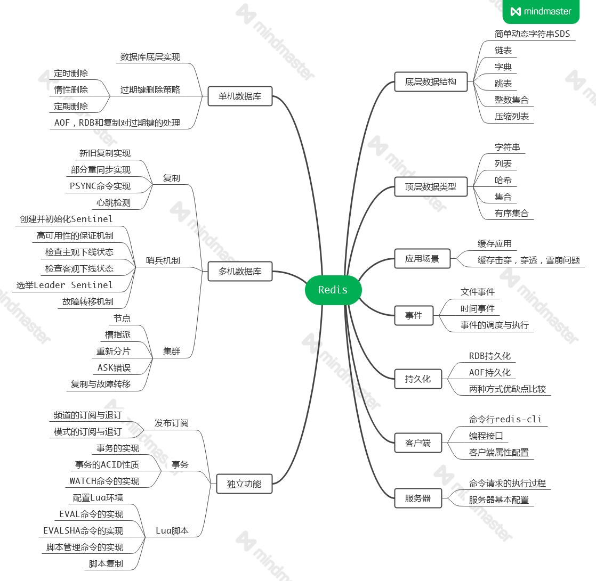
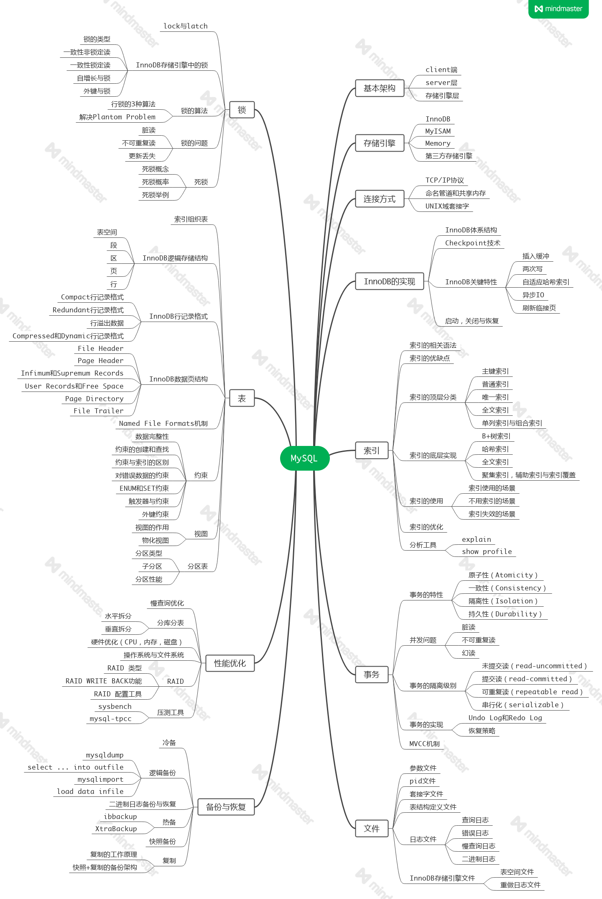
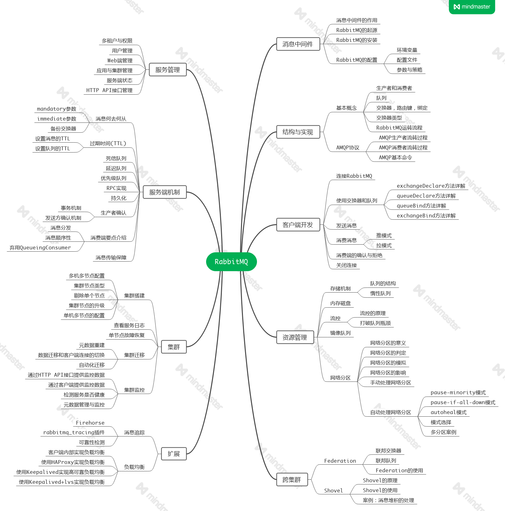

# 目录

## 技能树

### Golang

### Redis

### MySQL

### Nginx

### RabbitMQ

## SDK

[构建工具make和makefile编写](./std/cafdf12ee69bec6d9195f0c9307ad283.md)

[Go-Modules详解](./std/7963c3241f660333e66770b999610358.md)

[Go的自举](./std/163ce40937379b0315d83b29cb349c7b.md)

[Go的编译过程](./std/9aef27454c5df62def894f0bad45c625.md)

[Go的抽象语法树AST](./std/bec7c420b84c4e848e9259480d8eb11a.md)

[bufio读写机制剖析](./std/1edef46cb50498cbb8f1e6d0816554dd.md)

[net/http包路由机制详解](./std/557b6f167c0235c740405a209b834404.md)

[unsafe包详解](./std/cd10787177a22a08560b4b26fba49a7f.md)

[slice的底层实现](./std/80487aad121cf9be11c8aa1bd219e5ed.md)

[map的底层实现](./std/e6480ecfabffb4028372fc5d2909cf71.md)

[map的扩容机制](./std/73e254a888a9fbebaaed6875fc1c1a3f.md)

[context机制详解](./std/15ef742f3c8f1500f7e78936b88b776b.md)

[atomic原子操作](./std/d83755d0ff9855a2b602af77775bb07d.md)

[sync.Pool临时对象池](./std/2c2496a74b1243d762153dc2fdb8aa9f.md)

[sync.Map源码分析](./std/4cc5086abc237cd75fa591619deae465.md)

[sync包中的同步原语](./std/468b01a85672e8f37708aa5dcef2d521.md)

[sync包的实际应用](./std/27b92a32ea3922079b13f63faf5e46d3.md)

[log包源码分析](./std/a5127429a98b648f28ce2fc869160008.md)

## Currency

[GC-三色标记清除](./std/45574a7f4ed0c1ef3c239b250ba69564.md)

[G-M-P调度模型](./std/135e64075c7a0c96f2a15bca12fc7c70.md)

[Go中连接池的实现分析](./std/dc2304b5445bd93705e8a613373f86c9.md)

[Go中的并发限制与超时控制](./std/17f2b3867ba1cdfcc9f2116398ab36ad.md)

[实现一个Go并发处理队列](./std/64fef4899b9ea0c00617ded60f7f459f.md)

[Go的并发模型与并发模式](./std/d1126cba14c403d93622c1862941ab0d.md)

## Guide

[Uber-Golang编码规范-指导原则](./guide/efc4e3b51d06b3dde5fee816e6505914.md)

[Uber-Golang编码规范-性能与规范](./guide/545a7f4bb1f9fb1db36540a82f547019.md)

[Uber-Golang编码规范-编程模式](./guide/82a5a09e8d0f5faef9be628fb82d66e0.md)

## Unit-Test

[Go单元测试-基础原理](./unit/fe2d77a30ea3c2710404f6767f6d9a75.md)

[Go单元测试-mock框架](./unit/1c041f2235b3ccc29b92996532a66efd.md)

[Go单元测试-testify](./unit/6138348c4230add17aea69eb1fc35f1c.md)

[Go单元测试-依赖注入框架wire](./unit/3e906a19d83a7ca9ffabef0dc7f4654b.md)

## Benchmark

[Go benchmark性能测试](./bechmark/f04a1da7ec24fdc3c45ba62bac65c67a.md)

## Package

[日志库logrus](./lib/c6aea72f78bce2ac98917c53427f77c4.md)

[命令行库cli](./lib/7291c7df1d759949affdb99bde16499d.md)

[依赖注入wire](./lib/1bfdc00f58f271a2f8a4c270d79a35c3.md)

[访问控制casbin](./lib/d10de1c285078a0716d584293f302bd1.md)

[服务限流算法的几种实现](./lib/f8bdcb5371d0afa35b36c71bb2b1648b.md)

## Gin

[路由实现-Trie前缀树](./gin/ccb5ea25922bbdbabb4458364296346c.md)

[整体架构-各组件功能实现](./gin/03a1cf5434c15154c97868b9d07a4645.md)

## Gorm

## Grpc

[Protobuf语言指南](./grpc/a0e1e3109ce923c48fcdd18d3aaf6553.md)

[Protobuf生成Go代码指南](./grpc/47dee3eff68bc42187b2d6e958f3d9be.md)

[grpc的特性和背后的设计原则](./grpc/4aafe5445591ca04ea1a01f5ccb9c07d.md)

[grpc接口描述语言ProtoBuffer](./grpc/ca9310a72f2853a38fdba30ee817d1e8.md)

[grpc之Golang入门HelloWorld](./grpc/a7b875a7f97ab4acd41ea380128e4d20.md)

[grpc之流式调用原理http2协议分析](./grpc/592472ad5b65ce619f7949258ca82abf.md)

[grpc认证的多种方式实践](./grpc/b9b2cef4ae0967d353c12a915dc1735b.md)

[grpc拦截器的那些事](./grpc/aeeb6a1c25eb38ec3746dac068bd69bc.md)

[grpc服务注册与服务发现](./grpc/f7dbd0b69f26f000602b6e0a94d7b986.md)

[grpc-server启动分析](./grpc/b456e6f15c800b64001c759ef5145a8c.md)

[grpc的一次请求流程](./grpc/ae9e6625d4cc55338707a5c8b7dcc032.md)

[grpc跨语言通信实例](./grpc/3e226b258dd5734ed0c1e91777dd3305.md)

## Go-Kit

[go-kit的整体结构](./go-kit/fad0ab705c7d60ba7cd645fbb88727d0.md)

[basic授权认证中间件](./go-kit/5ea369e8a80fb8b332f86b89cfb0c5cc.md)

[endpoint源码分析](./go-kit/2ae340fadbe32d13d2498c410802d663.md)

[transport层之http-server](./go-kit/52345052a6f9a4ea12b236e2c5c990dd.md)

[transport层之http-client](./go-kit/b93acf62f8b62d487769c113527f5305.md)

[transport层之jsonrpc](./go-kit/b6cb9fd341765363f306fef479e7f2d9.md)

[transport层之grpc](./go-kit/7d86339e64c749c3482e604980bc8e8a.md)

[服务注册中心的通用功能实现](./go-kit/31362dddb72a6efb0978280b3f79cc64.md)

[服务注册中心的consul实现](./go-kit/4b29320d63e8b97a86bad51a1a9e5097.md)

## Go-Micro

## Etcd

## NSQ

[剖析nsq消息队列(一)简介及去中心化实现原理](./nsq/bd3be395e8e94863f67a2289bf7c9d98.md)

[剖析nsq消息队列(二)去中心化源码解析](./nsq/d320e4266e033cf4ed0edcc4f8091073.md)

[剖析nsq消息队列(三)消息传输的可靠性和持久化](./nsq/a38b6b46ac9ea1d2714bc20c496c3b36.md)

[剖析nsq消息队列(四)消息传输的可靠性和持久化](./nsq/9517598622412531c0a6ffdc97e5c69e.md)

[剖析nsq消息队列(五)消息的负载处理](./nsq/cccbc30c2792b5793ca6397792dbc2a5.md)

## Redis

[(转)Redis内部数据结构详解-dict](./redis/72a4228bd1837972d51159cef62f37a4.md)

[(转)Redis内部数据结构详解-sds](./redis/465a6cd28568d086e9aaa4206acefe05.md)

[跳表的原理及实现](./redis/250b12cefb8b44a26555f5442a224d50.md)

[Redis的两种持久化机制](./redis/225b07d051d77eec8944200ea688fd32.md)

[Redis的主从复制机制](./redis/92c273561eb14294e4b299917ebb460f.md)

[基于Redis的分布式锁实现](./redis/06d6b52568476822f5a2e9f0be2e1032.md)

[RedLock算法-使用redis实现分布式锁服务](./redis/41ebba3bc046c23a2a1b19a7bff2d3bb.md)

[浅谈分布式事务的实现模式](./redis/611b3158e4cf4399196d42c82f463cc0.md)

[缓存淘汰策略之LRU算法分析](./redis/20c57fc31aa7606867c3f2508cbf008f.md)

[缓存淘汰策略之LFU算法分析](./redis/b24c750436a508c67e8287da8c887c97.md)

[缓存淘汰策略之LRU算法改进](./redis/7582ec0043c5a8a28748a821ef2b968e.md)

[缓存雪崩，缓存穿透和缓存击穿方案分析](./redis/5322c71dcf4f89e769c39bb328e3fe17.md)

[理解snowflake算法的实现原理](./redis/4e9324ab5b9e8589c72dd5f602d35910.md)

## MySQL

[OLTP和OLAP的介绍和比较](./mysql/50eea3dcb3df93dbaf4bf9008845a251.md)

[InnoDB的事务实现机制](./mysql/28b067364356d358bfff17f816773949.md)

[必须了解的MySQL三大日志](./mysql/40e4aa65a0bfa47d090808382ffddc78.md)

[MySQL常用分库分表方案汇总](./mysql/0f5f04fb1afc6bd7d3b917101ffd65d0.md)

## Nginx

## 分布式事务

[分布式事务-基础篇](./distributed/4bf8818e4106ebf2461ffa7e4c90ad38.md)

[分布式事务解决方案之2PC(两阶段提交)](./distributed/7891b90c00736076ed36a4ced4d44efa.md)

## Message Queue

[分布式消息队列：如何保证消息队列的高可用](./mq/d5d61a06cf76d33ee30c8f6fe6637f2f.md)

[分布式消息队列：如何保证消息不被重复消费](./mq/79925a09b802ded410bd000cbe2d5c29.md)

[分布式消息队列：如何保证消息按顺序执行](./mq/ab46912cdfc280d4153a12cbe4187408.md)

[分布式消息队列：如何解决消息积压](./mq/0dac7c642652d075ff4730747038d408.md)

[分布式消息队列：如何保证消息的可靠性传输](./mq/613946bc627e881df3669c34dd6e2e5f.md)

[分布式消息队列：消息处理失败和死信队列](./mq/913bb532a934afd4382707f016419654.md)

## Rabbitmq

[rabbitmq实战指南(一)简介及入门使用](./rabbit/15091aa76ba1dc7686ddbd7c877347d3.md)

[rabbitmq实战指南(二)AMQP协议和RabbitMQ实现](./rabbit/99e34563464ba2f7544ddf1ecccf15c4.md)

## Kafka

## Docker

## Kubernetes

## Auth

[浅析Basic认证](./auth/17583d2da8e486854fac256903ac9bdd.md)

[JWT机制分析](./auth/9751f90ad8fd25438bf1e2f9d5618d5b.md)

[oAuth2.0授权机制](./auth/3c3524c954bbaa25bedb012d38258984.md)

[浅谈权限管理模型](./auth/e5a3a4a74dc9ffcfa99a04c00ff68c92.md)

## Network

[TCP三次握手与四次挥手](./net/49002627a472fc428fa100f2e5dbcc88.md)

[TCP滑动窗口与拥塞控制](./net/13aaa8179bf63eb427dc113480418096.md)

[HTTPS如何保证传输安全](./net/288fa6439aacddf7ffeb6cfcf44aee66.md)

[SSL双向认证与单向认证](./net/858f2ec213fc89884ce3df10358bd52a.md)

[网络中的指数躲避抖动算法](./net/e63666defbed996bf529cc25f77ba048.md)

[Linux IO模式及select,pool,epoll详解](./net/25ad3572861d5f4f03bfc03964c76287.md)

[彻底搞懂Reactor模型和Proactor模型](./net/e0c360144f2b2551242156800779fb96.md)

## Security

[Web安全之防止重放攻击](./security/4f892aec044772b882b5bd3391e84892.md)

[浅说XSS和CSRF](./security/985bfa1f7e6b5200ef0e0b30ddf63fc9.md)

[SQL注入原理与防护](./security/5e1b901b07a925488ada4bfc91ac044c.md)