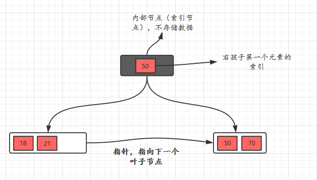
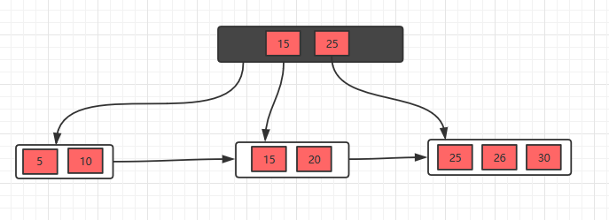
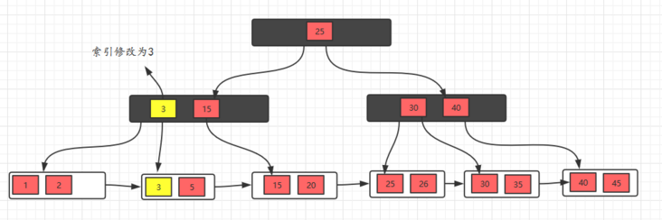
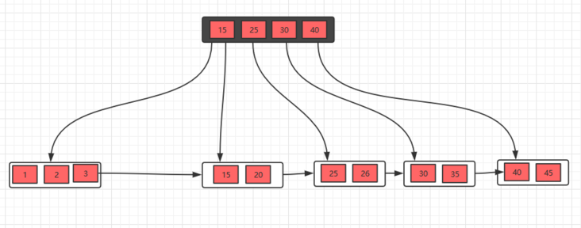

# B+树

B+树和B树一样也是多路平衡查找树，一个m阶B+树的定义如下：

- 每个节点最多有m-1个关键字(非叶子节点只存索引)

- 根节点最少可以有1个关键字。

- 非根节点至少有m/2个关键字。

- B+树有两种类型的节点：内部结点（也称索引结点）和叶子结点。内部节点就是非叶子节点，内部节点不存储数据，只存储索引，数据都存储在叶子节点。

- 内部结点中的key都按照从小到大的顺序排列，对于内部结点中的一个key，左树中的所有key都小于它，右子树中的key都大于等于它。叶子结点中的记录也按照key的大小排列。

- 每个叶子结点都存有相邻叶子结点的指针，叶子结点本身依关键字的大小自小而大顺序链接。

- 父节点存有右孩子的第一个元素的索引。

## B+树的插入

对于插入操作很简单，只需要记住一个技巧即可：当节点元素数量大于m-1的时候，按中间元素分裂成左右两部分，中间元素分裂到父节点当做索引存储，但是，本身中间元素还是分裂右边这一部分的。

下面以一颗5阶B+树的插入过程为例，5阶B+树的节点最少2个元素，最多4个元素。

- 插入5，10，15，20

- 插入25，此时元素数量大于4个了，分裂

- 接着插入26，30，继续分裂

## B+树的删除

对于删除操作是比B树简单一些的，因为叶子节点有指针的存在，向兄弟节点借元素时，不需要通过父节点了，而是可以直接通过兄弟节移动即可（前提是兄弟节点的元素大于m/2），然后更新父节点的索引；如果兄弟节点的元素不大于m/2（兄弟节点也没有多余的元素），则将当前节点和兄弟节点合并，并且删除父节点中的key，下面我们看看具体的实例。

- 初始状态

- 删除10，删除后，不满足要求，发现左边兄弟节点有多余的元素，所以去借元素，最后，修改父节点索引

- 删除元素5，发现不满足要求，并且发现左右兄弟节点都没有多余的元素，所以，可以选择和兄弟节点合并，最后修改父节点索引

- 发现父节点索引也不满足条件，所以，需要做跟上面一步一样的操作

这样，B+树的删除操作也就完成了。

## B树和B+树的区别

B+树相对于B树有一些自己的优势，可以归结为下面几点。

- 单一节点存储的元素更多，使得查询的IO次数更少，所以也就使得它更适合做为数据库MySQL的底层数据结构了。

- 所有的查询都要查找到叶子节点，查询性能是稳定的，而B树，每个节点都可以查找到数据，所以不稳定。

- 所有的叶子节点形成了一个有序链表，更加便于查找。
