# B树

B树是一棵多路平衡查找树，B树和B+树由简单的二叉树演变而来。一个m阶B树的定义如下：

- 每个节点最多有m-1个关键字(可以存键值对)。

- 根节点最少可以有1个关键字。

- 非根节点至少有m/2个关键字。

- 每个节点中的关键字都按照从小到大的顺序排列，每个关键字的左子树中的所有关键字都小于它，而右子树中的所有关键字都大于它。

- 所有叶子节点都位于同一层，或者说根节点到每个叶子节点的长度相同。

- 每个节点都存有索引和数据，也就是对应的key和value。

所以，根节点的关键字数量范围：1 <= k <= m-1，非根节点的关键字数量范围：m/2 <= k <= m-1。

描述一颗B树时需要指定它的阶数，阶数表示了一个节点最多有多少个孩子节点，一般用字母m表示阶数。

比如这里有一个5阶的B树，根节点数量范围：1 <= k <= 4，非根节点数量范围：2 <= k <= 4。

## B树的插入

插入的时候，需要记住一个规则：判断当前结点key的个数是否小于等于m-1，如果满足，直接插入即可，如果不满足，将节点的中间的key将这个节点分为左右两部分，中间的节点放到父节点中即可。

在5阶B树中，结点最多有4个key,最少有2个key（注意：下面的节点统一用一个节点表示key和value）。

- 插入18，70，50,40

- 插入22

插入22时，发现这个节点的关键字已经大于4了，所以需要进行分裂，分裂的规则在上面已经讲了，分裂之后，如下:

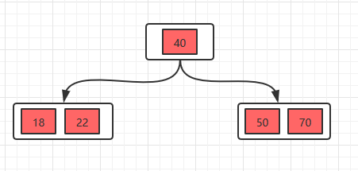

- 接着插入23，25，39

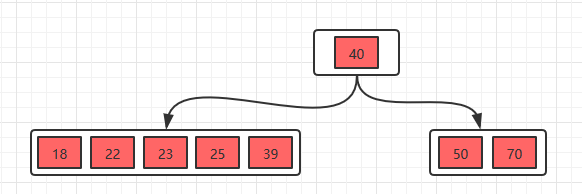

分裂，得到下面的。

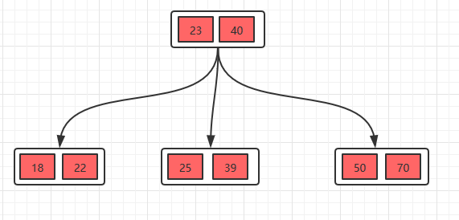

## B树的删除

B树的删除操作相对于插入操作是相对复杂一些的，但是，只要记住几种情况，一样可以很轻松的掌握的。

- 现在有一个初始状态是下面这样的B树，然后进行删除操作。

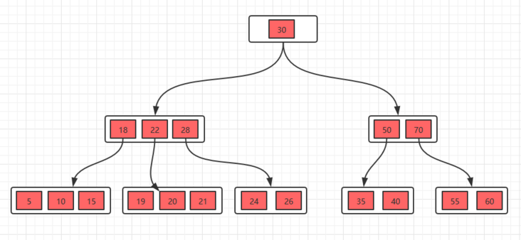

- 删除15，这种情况是删除叶子节点的元素，如果删除之后，节点数还是大于m/2，这种情况只要直接删除即可。

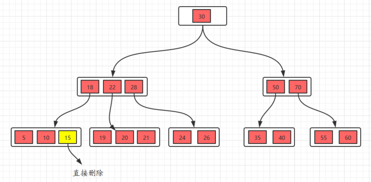

- 接着，我们把22删除，这种情况的规则：22是非叶子节点，对于非叶子节点的删除，我们需要用后继key（元素）覆盖要删除的key，然后在后继key所在的子支中删除该后继key。对于删除22，需要将后继元素24移到被删除的22所在的节点。

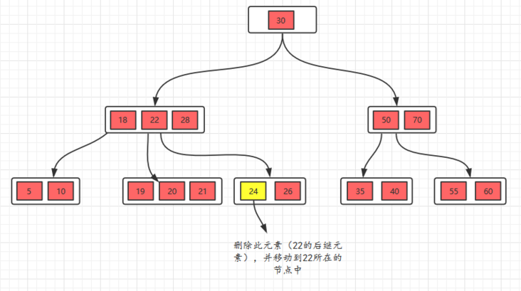

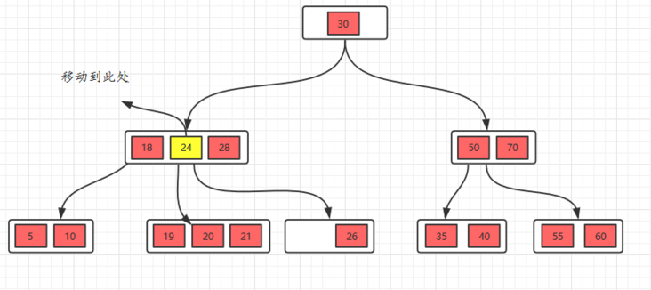

此时发现26所在的节点只有一个元素，小于2个（m/2），这个节点不符合要求，这时候的规则（向兄弟节点借元素）：如果删除叶子节点，如果删除元素后元素个数少于（m/2），并且它的兄弟节点的元素大于（m/2），也就是说兄弟节点的元素比最少值m/2还多，将先将父节点的元素移到该节点，然后将兄弟节点的元素再移动到父节点。这样就满足要求了。

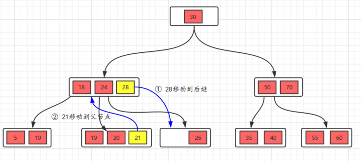

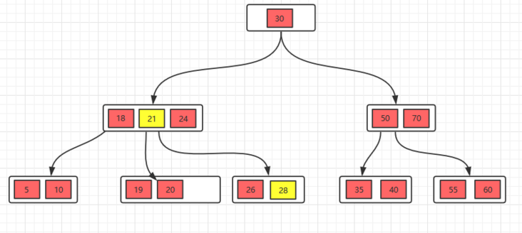

- 接着删除28，删除叶子节点，删除后不满足要求，所以，我们需要考虑向兄弟节点借元素，但是，兄弟节点也没有多的节点（2个），借不了，怎么办呢？如果遇到这种情况，首先，还是将先将父节点的元素移到该节点，然后，将当前节点及它的兄弟节点中的key合并，形成一个新的节点。

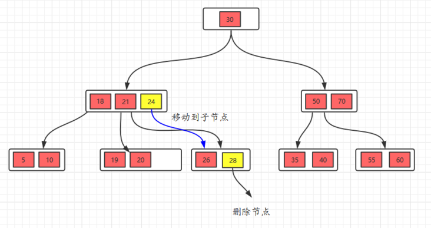

移动之后，跟兄弟节点合并。

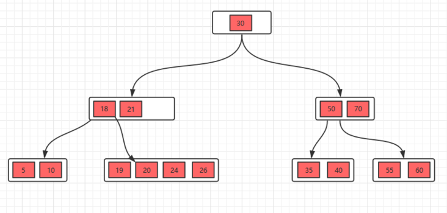

删除就只有上面的几种情况，根据不同的情况进行删除即可。

