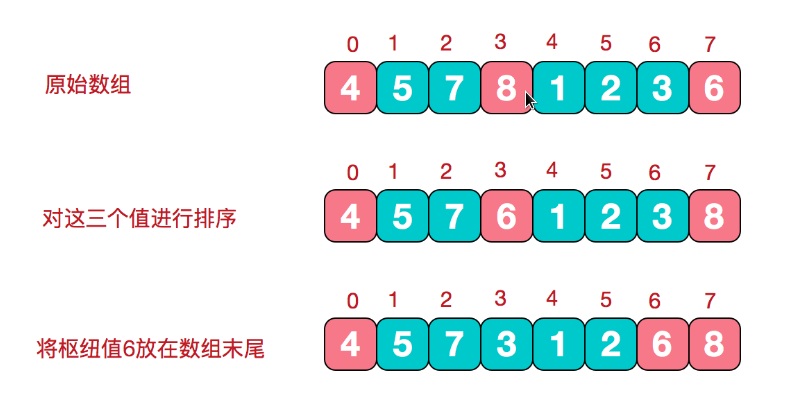
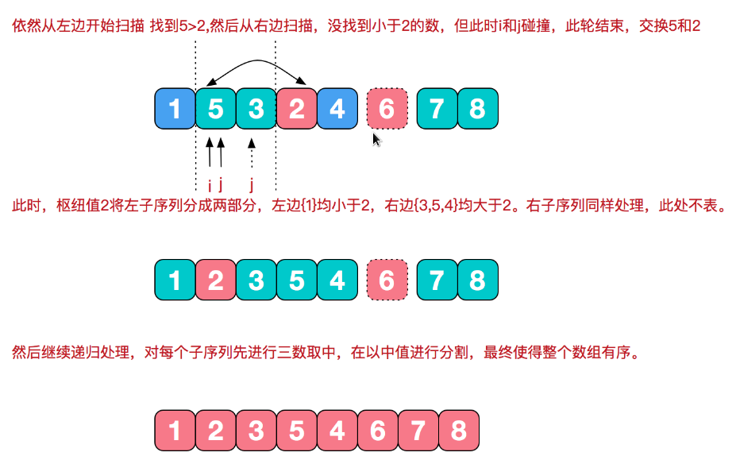

# 快速排序

快速排序由C. A. R. Hoare在1962年提出，它的基本思想是，通过一趟排序将要排序的数据分割成独立的两部分，其中一部分的数据都比另一部分的所有数据要小，然后再按此方法对这两部分数据分别进行快速排序，整个排序过程可以递归进行，以此达到整个数据变成有序序列。

## 步骤

三数取中：在快排的过程中，每一次我们要取一个数作为枢纽值，以这个数字来将序列划分为两部分。在此我们采用三数取中法，也就是取左端，中间，右端三个数，然后进行排序，将中间数作为枢纽值。



## 根据枢纽值进行分割

双向扫描，从左边找大于枢纽值的数，从右边找小于枢纽值的数，然后交换之。由于我们的枢纽值在右边，所以要先从左边开始扫描。


对左序列三数取中，并将中值放置数组末尾，然后扫描分割，右序同理。



快速排序是一种交换类的排序，它同样是分治法的经典体现。在一趟排序中将待排序的序列分割成两组，其中一部分记录均小于另一部分。然后分别对这两组继续进行排序，以使整个序列有序。在分割的过程中，枢纽值的选择至关重要，这里采取了三位取中法，可以很大程度上避免分组"一边倒"的情况。快速排序平均时间复杂度为O(nlogn)，是不稳定排序。

```go
package main

import (
	"fmt"
)

func QuickSort(a []int) {
	sort(a, 0, len(a)-1)
}

func sort(a []int, left int, right int) {
	if right - left < 2 {
		return
	}
	p := middle(a, left, right)
	i := left + 1
	j := right - 1
	for {
		for a[i] < p {
			i++
		}
		for a[j] > p {
			j++
		}
		if i < j {
			a[i], a[j] = a[j], a[i]
		} else {
			break
		}
	}
	a[i], a[j-1] = a[j-1], a[i]
	sort(a, left, i - 1)
	sort(a, i + 1, right)
}

func middle(a []int, left int, right int) int {
	center := (right + left)/2
	if a[left] > a[center] {
		a[left], a[center] = a[center], a[left]
	}
	if a[left] > a[right] {
		a[left], a[right] = a[right], a[left]
	}
	if a[center] > a[right] {
		a[center], a[right] = a[right], a[center]
	}
	a[right-1], a[center] = a[center], a[right-1]
	return a[right-1]
}

func main() {
	beforeSortSet := []int {10, 22, 33, 21, 56, 32, 81, 73, 69, 83}
	fmt.Println("Before Sort:", beforeSortSet)
	QuickSort(beforeSortSet)
	fmt.Println("After Sort:", beforeSortSet)
}
```
