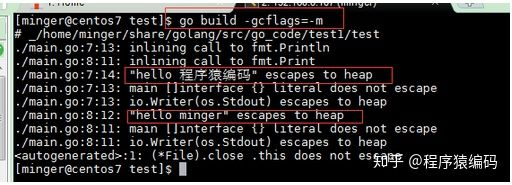

# Golang内存分配逃逸分析

在C/C++开发中，动态分配内存(new/malloc)需要我们手动释放资源。这样做的好处是，需要申请多少内存空间可以很好的掌握怎么分配。但是这有个缺点，如果忘记释放内存，则会导致内存泄漏。在很多高级语言中(python/Go/java)都加上了垃圾回收机制。

Go的垃圾回收，让堆和栈堆程序员保持透明。真正解放了程序员的双手，让他们可以专注于业务，“高效”地完成代码编写。把那些内存管理的复杂机制交给编译器。

## 堆和栈

栈 可以简单得理解成一次函数调用内部申请到的内存，它们会随着函数的返回把内存还给系统。下面来看看一个例子

```go
func F() {
	temp := make([]int, 0, 20)
	...
}
```

上面的例子，内函数内部申请的临时变量，即使你是用make申请到的内存，如果发现在退出函数后没有用了，那么就把丢到栈上，毕竟栈上的内存分配比堆上快很多。

下面再看一个堆的例子：

```go
func F() []int{
	a := make([]int, 0, 20)
	return a
}
```

而上面这段代码，申请的代码和上面的一模一样，但是申请后作为返回值返回了，编译器会认为在退出函数之后还有其他地方在引用，当函数返回之后并不会将其内存归还。那么就申请到堆里。

如果变量都分配到堆上，堆不像栈可以自动清理。它会引起Go频繁地进行垃圾回收，而垃圾回收会占用比较大的系统开销。

## 堆与栈优缺点

堆适合不可预知的大小的内存分配。但是为此付出的代价是分配速度较慢，而且会形成内存碎片。

栈内存分配则会非常快，栈分配内存只需要两个CPU指令：“PUSH”和“RELEASE”分配和释放；而堆分配内存首先需要去找到一块大小合适的内存块。之后要通过垃圾回收才能释放。

## 逃逸分析

逃逸分析是一种确定指针动态范围的方法。简单来说就是分析在程序的哪些地方可以访问到该指针。

简单来说，编译器会根据变量是否被外部引用来决定是否逃逸：

1. 如果函数外部没有引用，则优先放到栈中；

2. 如果函数外部存在引用，则必定放到堆中；

对此你可以理解为，逃逸分析是编译器用于决定变量分配到堆上还是栈上的一种行为。

注意：go 在编译阶段确立逃逸，并不是在运行时。

## 指针逃逸

函数传递指针真的比传值效率高吗？

我们知道传递指针可以减少底层值的拷贝，可以提高效率，但是如果拷贝的数据量小，由于指针传递会产生逃逸，可能会使用堆，也可能会增加GC的负担，所以传递指针不一定是高效的。

如何得知变量是分配在栈(stack)上还是堆(heap)上？

准确地说，你并不需要知道。Golang 中的变量只要被引用就一直会存活，存储在堆上还是栈上由内部实现决定而和具体的语法没有关系。

知道变量的存储位置确实和效率编程有关系。如果可能，Golang 编译器会将函数的局部变量分配到函数栈帧(stack frame)上。 然而，如果编译器不能确保变量在函数 return之后不再被引用，编译器就会将变量分配到堆上。而且，如果一个局部变量非常大，那么它也应该被分配到堆上而不是栈上。

当前情况下，如果一个变量被取地址，那么它就有可能被分配到堆上。然而，还要对这些变量做逃逸分析，如果函数return之后，变量不再被引用，则将其分配到栈上。

Go可以返回局部变量指针，这其实是一个典型的变量逃逸案例，示例代码如下：

```go
package main

type Student struct {
    Name string
    Age  int
}

func StudentRegister(name string, age int) *Student {
    s := new(Student) //局部变量s逃逸到堆

    s.Name = name
    s.Age = age

    return s
}

func main() {
    StudentRegister("Jim", 18)
}
```
虽然在函数 StudentRegister() 内部 s 为局部变量，其值通过函数返回值返回，s 本身为一指针，其指向的内存地址不会是栈而是堆，这就是典型的逃逸案例。

终端运行命令查看逃逸分析日志：

```cmd
# 指令集 -gcflags 用于将标识参数传递给 Go 编译器。
# -m 会打印出逃逸分析的优化策略。
go build -gcflags=-m
```

可见在StudentRegister()函数中，也即代码第9行显示”escapes to heap”，代表该行内存分配发生了逃逸现象。


可见在StudentRegister()函数中，也即代码第9行显示”escapes to heap”，代表该行内存分配发生了逃逸现象。

## 栈空间不足逃逸

```go
package main

func main() {

	s := make([]int, 1000, 1000)

    for index, _ := range s {
        s[index] = index
    }
}
```

上面代码主函数中分配了一个1000个长度的切片，是否逃逸取决于栈空间是否足够大。 直接查看编译提示，如下：

终端运行命令查看逃逸分析日志：


根据上面的信息，没有发生逃逸。分配了一个1000的长度还不足以发生逃逸现象。然后就x10倍吧，再看看情况。

```go
package main

func main() {

	s := make([]int, 10000, 10000)

    for index, _ := range s {
        s[index] = index
    }
}
```

终端运行命令查看逃逸分析日志：


当切片长度扩大到10000时就会逃逸。实际上当栈空间不足以存放当前对象时或无法判断当前切片长度时会将对象分配到堆中。

## 动态类型逃逸

很多函数参数为interface类型。比如：

```go
func Printf(format string, a ...interface{}) (n int, err error)

func Sprintf(format string, a ...interface{}) string

func Fprint(w io.Writer, a ...interface{}) (n int, err error)

func Print(a ...interface{}) (n int, err error)

func Println(a ...interface{}) (n int, err error)
```

编译期间很难确定其参数的具体类型，也能产生逃逸。

```go
package main

import "fmt"

func main() {

	fmt.Println("hello 程序猿编码")
	fmt.Print("hello minger")
}
```



## 逃逸分析的作用

1. 逃逸分析的好处是为了减少gc的压力，不逃逸的对象分配在栈上，当函数返回时就回收了资源，不需要gc标记清除。

2. 逃逸分析完后可以确定哪些变量可以分配在栈上，栈的分配比堆快，性能好(逃逸的局部变量会在堆上分配 ,而没有发生逃逸的则有编译器在栈上分配)。

3. 同步消除，如果你定义的对象的方法上有同步锁，但在运行时，却只有一个线程在访问，此时逃逸分析后的机器码，会去掉同步锁运行。

## 总结

1. 堆上动态分配内存比栈上静态分配内存，开销大很多。

2. 变量分配在栈上需要能在编译期确定它的作用域，否则会分配到堆上。

3. Go编译器会在编译期对考察变量的作用域，并作一系列检查，如果它的作用域在运行期间对编译器一直是可知的，那么就会分配到栈上。简单来说，编译器会根据变量是否被外部引用来决定是否逃逸。

4. 对于Go程序员来说，编译器的这些逃逸分析规则不需要掌握，我们只需通过go build -gcflags '-m’命令来观察变量逃逸情况就行了。

5. 不要盲目使用变量的指针作为函数参数，虽然它会减少复制操作。但其实当参数为变量自身的时候，复制是在栈上完成的操作，开销远比变量逃逸后动态地在堆上分配内存少的多。

6. 逃逸分析在编译阶段完成的。

