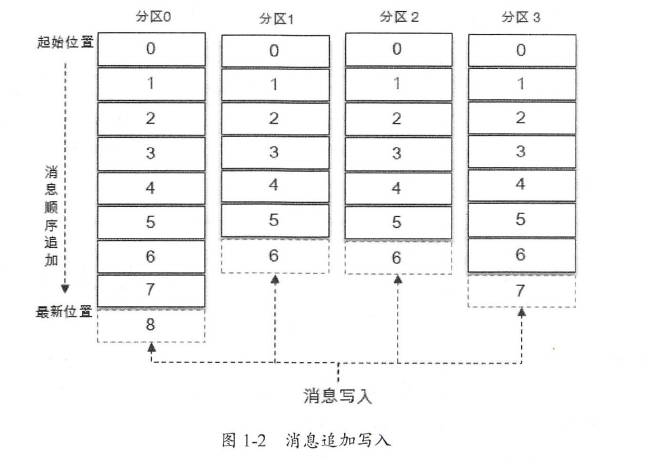

# kafka体系结构

Kafka是一个分布式流式处理平台，具有高吞吐，可持久化，可水平扩展，支持流式数据处理等多种特性。支持与多种开源分布式处理系统Cloudra，Storm，Spark，Flink等进行集成。

## 体系结构

一个典型的Kakfa体系架构包括若干Producer，若干broker，若干Consumer，以及一个Zookeeper集群。

- Zookeeper：是Kafka用来负责集群元数据管理，控制器选举等操作的。

- Producer：生产者，发送消息的一方。生产者负责创建消息，然后将其投递到Kafka中。

- Consumer：消费者，接收消息的一方。消费者连接到Kafka并接收消息，进行相应的业务逻辑处理。

- Broker：服务代理节点，对Kafka而言，一个Broker可以看作一个Kafka实例，一个或多个Broker组成了一个Kafka集群。

## 主体与分区

Kafka中有两个特别重要的概念：主题(Topic)与分区(Partition)，Kafka中的消息以主题为单位进行归类，生产者和消费者都以主题为目标进行生产和消费。

主题是一个逻辑概念，物理上划分为多个分区，一个分区只属于单个主体，同一主题下的不同分区包含的消息是不同的。

分区在存储层面可以看作一个可追加的日志文件，消息在被追加到分区日志文件时会分配一个特定的偏移量(offset)，offset是消息在分区中的唯一标识，Kafka通过它来维护消息在分区中的顺序性。

Kafka保证同一分区内消息有序，而不保证主题中的消息有序。

如果所示的topic有4个分区，消息被顺序追加到每个分区日志文件的尾部。Kafka中的分区分布在不同的服务器(broker)上，也就是说，一个主题可以横跨多个broker，以此来提供比单个broker更强大的功能。

每一条消息被发送到broker之前，会根据分区规则选择存储到哪个具体分区。如果分区规则设定的合理，所有的消息都可以均匀的分配到不同的分区中。

如果一个主题只对应一个文件，那么这个文件所在的机器的IO将成为这个主题的性能瓶颈，而分区解决了这个问题。

在创建主题的时候可以通过指定的参数来设置分区的个数，当然也可以在主题创建完成之后去修改分区的数量，通过增加分区的数量可以实现水平扩展。

