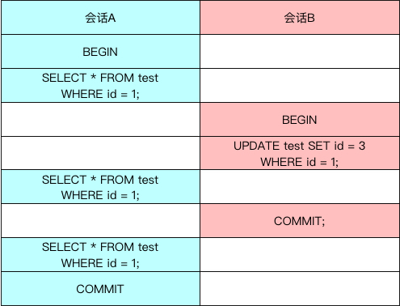

# MVCC实现机制

## 什么是MVCC

MVCC(Multi Version Concurrency Control)多版本并发控制，是数据库引擎中常见的处理读写冲突的手段，目的在于提高数据库高并发场景下的吞吐性能。

不同的事务在并发过程中，SELECT操作可以不加锁而是通过MVCC机制读取指定的版本历史记录，并通过一些手段保证读取的记录值符合事务所处的隔离级别，从而解决并发场景下的读写冲突。

## 一致性非锁定读

一致性非锁定读(Consistent Nonlocking Read)是指InnoDB存储引擎通过MVCC读取当前数据库中行数据的方式。如果读取的行正在DELETE或UPDATE操作，这时读取操作不会因此去等待行上锁的释放而是会读取一个行的快照。


InnoDB通过undo log来实现MVVC。undo log本身用来在事务中回滚数据，因此快照数据本身是没有额外开销。此外，读取快照数据是不需要上锁的，因为没有事务需要对历史的数据进行修改操作。

一致性非锁定读是InnoDB默认的读取方式，即读取不会占用和等待行上的锁。但是并不是在每个事务隔离级别下都是采用此种方式。此外，即使都是使用一致性非锁定读，但是对于快照数据的定义也各不相同。

在事务隔离级别READ COMMITTED和REPEATABLE READ下，InnoDB使用一致性非锁定读。然而，对于快照数据的定义却不同。在READ COMMITTED事务隔离级别下，一致性非锁定读总是读取被锁定行的最新一份快照数据。而在REPEATABLE READ事务隔离级别下，则读取事务开始时的行数据版本。

下面举个例子来详细说明一下上述的情况。

```
# session A
mysql> BEGIN;
mysql> SELECT * FROM test WHERE id = 1;
```

首先在会话A中显示地开启一个事务，然后读取test表中的id为1的数据，但是事务并没有结束。于此同时，用户在开启另一个会话B，这样可以模拟并发的操作，然后对会话B做出如下的操作：

```
# session B
mysql> BEGIN;
mysql> UPDATE test SET id = 3 WHERE id = 1;
```

在会话B的事务中，将test表中id为1的记录修改为id=3，但是事务同样也没有提交，这样id=1的行其实加了一个排他锁。由于InnoDB在READ COMMITTED和REPEATABLE READ事务隔离级别下使用一致性非锁定读，这时如果会话A再次读取id为1的记录，仍然能够读取到相同的数据。此时，READ COMMITTED和REPEATABLE READ事务隔离级别没有任何区别。



当会话B提交事务后，会话A再次运行SELECT * FROM test WHERE id = 1的SQL语句时，两个事务隔离级别下得到的结果就不一样了。

对于READ COMMITTED的事务隔离级别，它总是读取行的最新版本，如果行被锁定了，则读取该行版本的最新一个快照。因为会话B的事务已经提交，所以在该隔离级别下上述SQL语句的结果集是空的。

对于REPEATABLE READ的事务隔离级别，总是读取事务开始时的行数据，因此，在该隔离级别下，上述SQL语句仍然会获得相同的数据。

## 具体实现

InnoDB 中 MVCC 的实现方式为：每一行记录都有两个隐藏列： DATA_TRX_ID 、 DATA_ROLL_PTR （如果没有主键，则还会多一个隐藏的主键列）。

- DATA_TRX_ID:记录最近更新这条行记录的事务ID ，大小为6个字节

- DATA_ROLL_PTR:表示指向该行回滚段(rollback segment)的指针，大小为7个字节，InnoDB便是通过这个指针找到之前版本的数据。该行记录上所有旧版本，在Undo Log中都通过链表的形式组织。

- DB_ROW_ID:行标识(隐藏单调自增ID)，大小为6字节，如果表没有主键，InnoDB会自动生成一个隐藏主键，因此会出现这个列。另外，每条记录的头信息(record header)里都有一个专门的bit(deleted_flag)来表示当前记录是否已经被删除。

## 如何组织版本链

在多个事务并行操作某行数据的情况下，不同事务对该行数据的UPDATE会产生多个版本，然后通过回滚指针组织成一条Undo Log链，我们通过一个简单的例子来看一下Undo Log链是如何组织的，DATA_TRX_ID和  DATA_ROLL_PTR两个参数在其中又起到什么样的作用。

事务A对值x进行更新之后，该行即产生一个新版本和旧版本。假设之前插入该行的事务ID为100，事务A的ID为200，该行的隐藏主键为1。


事务A的操作过程为：

对DB_ROW_ID = 1的这行记录加排他锁

把该行原本的值拷贝到Undo Log中，DB_TRX_ID和DB_ROLL_PTR都不动

修改该行的值这时产生一个新版本，更新DATA_TRX_ID为修改记录的事务ID，将DATA_ROLL_PTR指向刚刚拷贝到Undo Log链中的旧版本记录，这样就能通过DB_ROLL_PTR找到这条记录的历史版本。如果对同一行记录执行连续的UPDATE，Undo Log会组成一个链表，遍历这个链表可以看到这条记录的变迁

记录Redo Log ，包括Undo Log中的修改

那么INSERT和DELETE会怎么做呢？其实相比UPDATE这二者很简单，INSERT会产生一条新纪录，它的DATA_TRX_ID为当前插入记录的事务ID；DELETE某条记录时可看成是一种特殊的UPDATE，其实是软删，真正执行删除操作会在commit时，DATA_TRX_ID则记录下删除该记录的事务ID。

## 如何实现一致性读-ReadView

在RU隔离级别下，直接读取版本的最新记录就OK，对于SERIALIZABLE隔离级别，则是通过加锁互斥来访问数据，因此不需要MVCC的帮助。因此MVCC运行在RC和RR这两个隔离级别下，当InnoDB隔离级别设置为二者其一时，在SELECT数据时就会用到版本链

核心问题是版本链中哪些版本对当前事务可见？

InnoDB为了解决这个问题，设计了ReadView(可读视图)的概念。

### RR下ReadView的生成

在RR隔离级别下，每个事务touch first read时(本质上就是执行第一个SELECT语句时，后续所有的SELECT都是复用这个ReadView，其它update,delete,insert语句和一致性读snapshot的建立没有关系)，会将当前系统中的所有的活跃事务拷贝到一个列表生成ReadView。

下图中事务A第一条SELECT语句在事务B更新数据前，因此生成的ReadView在事务A过程中不发生变化，即使事务B在事务A之前提交，但是事务A第二条查询语句依旧无法读到事务B的修改。


下图中，事务A的第一条SELECT语句在事务B的修改提交之后，因此可以读到事务B的修改。但是注意，如果事务A的第一条SELECT语句查询时，事务B还未提交，那么事务A也查不到事务B的修改。


### RC下ReadView的生成

在RC隔离级别下，每个SELECT语句开始时，都会重新将当前系统中的所有的活跃事务拷贝到一个列表生成ReadView。二者的区别就在于生成ReadView的时间点不同，一个是事务之后第一个SELECT语句开始、一个是事务中每条SELECT语句开始。

ReadView中是当前活跃的事务ID列表，称之为m_ids，其中最小值为up_limit_id，最大值为low_limit_id，事务ID是事务开启时InnoDB分配的，其大小决定了事务开启的先后顺序，因此我们可以通过ID的大小关系来决定版本记录的可见性，具体判断流程如下：

- 如果被访问版本的trx_id小于m_ids中的最小值up_limit_id，说明生成该版本的事务在ReadView生成前就已经提交了，所以该版本可以被当前事务访问。

- 如果被访问版本的trx_id大于m_ids列表中的最大值low_limit_id，说明生成该版本的事务在生成ReadView后才生成，所以该版本不可以被当前事务访问。需要根据Undo Log链找到前一个版本，然后根据该版本的DB_TRX_ID重新判断可见性。

- 如果被访问版本的trx_id属性值在m_ids列表中最大值和最小值之间(包含)，那就需要判断一下trx_id的值是不是在m_ids列表中。如果在，说明创建ReadView时生成该版本所属事务还是活跃的，因此该版本不可以被访问，需要查找Undo Log链得到上一个版本，然后根据该版本的DB_TRX_ID再从头计算一次可见性；如果不在，说明创建ReadView时生成该版本的事务已经被提交，该版本可以被访问。

- 此时经过一系列判断我们已经得到了这条记录相对ReadView来说的可见结果。此时，如果这条记录的delete_flag为true，说明这条记录已被删除，不返回。否则说明此记录可以安全返回给客户端。


### RR下的MVCC判断流程

如果在RR隔离级别下，为什么事务B前后两次均查询到10呢？ RR下生成ReadView是在事务开始时，m_ids[200,300]，后面不发生变化，因此即使事务A提交了，trx_id为200的记录依旧处于m_ids中，不能被访问，只能访问版本链中的记录10。

### RC下的MVCC判断流程

为什么事务B在RC隔离级别下，两次查询的x值不同。RC下ReadView是在语句粒度上生成的。

当事务A未提交时，事务B进行查询，假设事务B的事务ID为300，此时生成ReadView的m_ids为[200，300]，而最新版本的trx_id为200，处于m_ids中，则该版本记录不可被访问，查询版本链得到上一条记录的trx_id为100，小于m_ids的最小值200，因此可以被访问，此时事务B就查询到值10而非20。

待事务A提交之后，事务B进行查询，此时生成的ReadView的m_ids为[300]，而最新的版本记录中trx_id为200 ，小于m_ids的最小值300，因此可以被访问到，此时事务B就查询到20。

## 总结

RR、RE两种隔离级别的事务在执行普通的读操作时，通过访问版本链的方法，使得事务间的读写操作得以并发执行，从而提升系统性能。RC、RR这两个隔离级别的一个很大不同就是生成ReadView的时间点不同，RC在每一次SELECT语句前都会生成一个ReadView，事务期间会更新，因此在其他事务提交前后所得到的m_ids列表可能发生变化，使得先前不可见的版本后续又突然可见了。而RR只在事务的第一个SELECT语句时生成一个ReadView，事务操作期间不更新。
