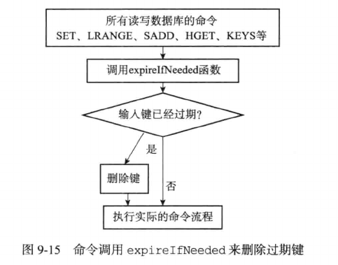

# 过期键删除策略

对于过期键的删除，有三种策略：

- 定时删除：在设置键的过期时间的同时，创建一个定时器(timer)，让定时器在键的过期时间来临时，立即执行对键的删除操作。

- 惰性删除：放任键过期不管，但是每次从键空间中获取键时，都检查取得的键是否过期，如果过期的话，就删除该键，如果没过期，就返回该键。

- 定期删除：每隔一段时间，程序就对数据库进行一次检查，删除里面的过期键。至于要删除多少过期键，以及要检查多少个数据库，由算法决定。

三种策略中，第一种和第三种为主动策略，第二种为被动策略。

## 定时删除

定时删除策略对内存友好，通过使用定时器，可以保证过期键会尽可能快的删除，并释放其占用的内存。

定时删除策略对CPU不友好，如果过期键比较多，删除操作会占用相当的CPU时间，影响服务器的响应时间和吞吐量。

创建一个定时器需要借助Redis服务器中的时间事件，时间事件的实现方式是无序链表，查找一个事件的时间复杂度为O(N)，并不能高效处理大量时间事件。

因此，让服务器创建大量的定时器，来实现定时删除策略，并不现实。

## 惰性删除

惰性删除策略对CPU友好，程序只会在取出键时才会对键进行过期检查，这可以保证删除过期键的操作只会在非做不可的情况下执行，

惰性删除策略对内存不友好，如果一个键已经过期又仍然保存在数据库中，如果这个键不被访问，它占用的内存将永不被释放。

对于一些和时间相关的数据，比如日志(log)，在某个时间点之后，对它们的访问会大大减少，甚至不再访问，如果这类过期数据大量积压在数据库中，造成的内存泄漏会导致很严重的问题。

## 定期删除

定期删除策略是两种策略的一种整合和折中：

- 定期删除策略每隔一段时间执行一次删除过期键操作，并通过限制删除操作的执行时间和频率来减少对CPU时间的影响。

- 除此之外，通过定期删除过期键，定期删除策略有效的减少了因为过期键带来的内存浪费。

如何确定定期删除的执行时长和频率是一个问题：

- 如果删除操作执行的太频繁，或者执行时间过长，定期删除策略会退化为定时删除策略，将CPU时间过多消耗在删除过期键上。

- 如果删除操作执行的太少，或者时间太短，定期删除又会和惰性删除策略一样，出现内存浪费情况。

因此必须结合服务器的实际情况，合理设置删除操作的执行时长和执行频率。

## Redis的过期键删除策略

Redis服务器使用惰性删除和定期删除两种策略：通过两种策略配合使用，服务器很好的在合理使用CPU时间和避免浪费内存之间取得平衡。

### 惰性删除策略实现

过期键的惰性删除策略由db.c/expireIfNeeded函数实现，所有读写数据库的Redis命令在执行之前都会调用expireIfNeeded函数对输入键进行检查：

- 如果输入键已经过期，那么expireIfNeeded函数将输入键从数据库中删除

- 如果输入键未过期，那么expireIfNeeded不做任何操作

每个命令的实现需要对expireIfNeeded返回做处理：

- 当键存在时，命令按照键的存在情况执行

- 当键不存在或者过期被expireIfNeeded删除时，命令按照键不存在的情况执行

### 定期删除策略实现

过期键的定期删除策略由redis.c/activeExpireCycle函数实现，每当Redis的服务器周期性操作redis.c/serverCron函数时，activeExpireCycle函数会被调用，它在规定时间内分多次遍历服务器中各个数据库，从数据库的expires字典中随机检查一部分键的过期时间，并删除其中的过期键。

activeExpireCycle函数的工作模式可以总结如下：

- 函数每次运行时，都从一定数量的数据库中取出一定数量的随机键进行检查，并删除其中的过期键

- 全局变量current_db会记录当前activeExpireCycle函数检查的进度，并在下一次activeExpireCycle函数调用时，接着上一次的进度进行处理。

- 随着activeExpireCycle函数的不断执行，服务器中的所有数据库都会被检查一遍，这时函数将current_db变量重置为0，然后开始新一轮检查工作。

## RDB，AOF和复制对过期键的处理

### RDB对过期键的处理

在执行SAVE命令或者BGSAVE命令创建一个RDB文件时，程序会对数据库中的键进行检查，已经过期的键不会保存在新建的RDB文件中。

在启动Redis时，如果服务器开启了RDB功能，那么服务器将对RDB文件进行载入：

- 如果服务器以主服务器模式运行，那么载入RDB文件时，程序会对文件中保存的键进行检查，未过期的键会被载入到数据库中，而过期的键会被忽略。

- 如果服务器以从服务器模式运行，那么载入RDB文件时，文件中保存的所有键，无论是否过期，都会被载入到数据库中。

### AOF对过期键的处理

- 当服务器以AOF持久化模式运行时，如果数据库中某个键已经过期，但它还没有被惰性删除或者定期删除，AOF不会因此产生任何影响。

- 当过期键被惰性删除或者定期删除后，程序会向AOF文件追加(append)一条DEL命令，来显式记录该键已被删除。

- 和生成RDB文件类似，在执行AOF重写时，程序会对数据库中的键进行检查，已过期的不会被保存到重写的AOF文件中。

### 复制功能

当服务器运行在复制模式下时，从服务器的过期删除动作由主服务器控制：

- 主服务器在删除一个过期键之后，会显示地向所有从服务器发送一个DEL命令，告知从服务器删除这个过期键。

- 从服务器在执行客户端发送的命令时，即使碰到过期键也不会将过期键删除，而是继续像处理未过期的键一样来处理过期键。

- 从服务器只有在接到主服务器发送来的DEL命令后，才会删除过期键。

通过由主服务器来控制从服务器统一地删除过期键，可以保证从服务器数据的一致性，也正是出于这个原因，当一个过期键仍然存在于主服务器的数据库时，这个过期键在从服务器里的复制品也会继续存在。

